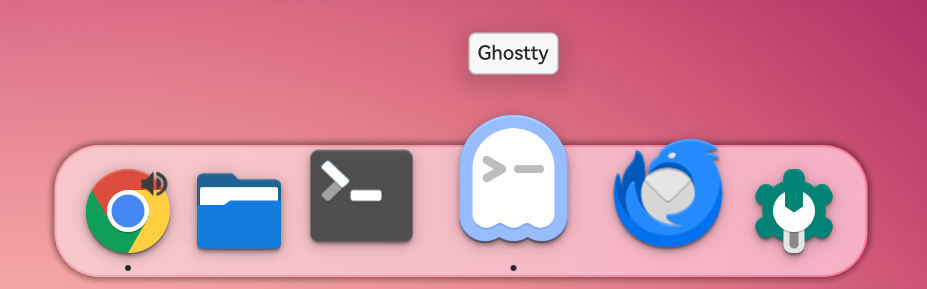

#  Latte Dock NG

> **Fork notice**: This is an unofficial fork of [KDE Latte Dock](https://github.com/KDE/latte-dock) maintained by Ruizhi Zhong, targeting **KDE Plasma 6.6+ on Wayland only**. X11 support has been intentionally removed.

Latte Dock NG is a Wayland-first dock for KDE Plasma 6.6+ that provides an elegant and intuitive experience for your tasks and widgets. It animates its contents using a parabolic zoom effect and stays out of the way when not needed.

**"Art in Coffee"**

Screenshots
===========

Classic dock style:


Modern dock style:



Development
============

- This fork: https://github.com/ruizhi-lab/latte-dock-ng
- Release notes: `CHANGELOG.md`
- Upstream KDE repo: https://invent.kde.org/plasma/latte-dock
- GitHub mirror of upstream: https://github.com/KDE/latte-dock
- Bug reports for this fork: https://github.com/ruizhi-lab/latte-dock-ng/issues
- Bug reports for upstream: https://bugs.kde.org/enter_bug.cgi?product=lattedock


Installation
============

### Requirements

We need to use at least:

- **Plasma >= 6.6.0**
- **PlasmaWaylandProtocols >= 1.6.0**
- **Qt >= 6.6**
- **Wayland session (X11 is not supported in this fork)**

Minimum requirements:
 
**tools:**
```
 bash
 cmake >= 3.16
 extra-cmake-modules
```

**development packages for:**
```
 Qt6Core >= 6.6.0
 Qt6Gui >= 6.6.0
 Qt6DBus >= 6.6.0
 Qt6Qml >= 6.6.0
 Qt6Quick >= 6.6.0
 Qt6Widgets >= 6.6.0
 Qt6WaylandClient >= 6.6.0

 Plasma >= 6.6.0
 PlasmaQuick >= 6.6.0
 PlasmaActivities >= 6.6.0
 KWayland >= 6.6.0
 LibTaskManager >= 6.6.0

 KF6CoreAddons >= 6.0.0
 KF6GuiAddons >= 6.0.0
 KF6DBusAddons >= 6.0.0
 KF6Declarative >= 6.0.0
 KF6Package >= 6.0.0
 KF6XmlGui >= 6.0.0
 KF6IconThemes >= 6.0.0
 KF6KIO >= 6.0.0
 KF6I18n >= 6.0.0
 KF6Notifications >= 6.0.0
 KF6NewStuff >= 6.0.0
 KF6Archive >= 6.0.0
 KF6GlobalAccel >= 6.0.0
 KF6Crash >= 6.0.0
 KF6WindowSystem >= 6.0.0

 PlasmaWaylandProtocols >= 1.6
 Wayland::Client
```
### From my personal gentoo overlay for Gentoo Linux

```bash
eselect repository add ruizhi-overlay git https://github.com/ruizhi-lab/gentoo-overlay.git
emaint sync -r ruizhi-overlay
emerge -av kde-misc/latte-dock-ng
```

### From source

```bash
git clone https://github.com/ruizhi-lab/latte-dock-ng.git
cd latte-dock-ng
mkdir build && cd build
cmake .. -DCMAKE_INSTALL_PREFIX=/usr
make -j$(nproc)
sudo make install
```

See the [installation instructions](./INSTALLATION.md) for distro-specific dependency setup.

### Helper scripts

```bash
# Build + install (pre-clean enabled by default)
bash install.sh --help
bash install.sh
bash install.sh --clean --purge-user-data

# Uninstall (manifest + known root/user override paths)
bash uninstall.sh --help
bash uninstall.sh --dry-run
bash uninstall.sh --purge-user-data
```

## Run Latte Dock NG

Latte Dock NG is now ready to be used by executing
```
latte-dock-ng
```

or activating **Latte Dock NG** from the applications menu.


Contributors
============
- [Ruizhi Zhong](https://github.com/ruizhi-lab): Maintainer of this fork (Plasma 6.6+ / Wayland).
- [Varlesh](https://github.com/varlesh): Logos and Icons.
- Original Latte Dock authors and contributors: thank you for the upstream foundation.


License & Copyright
===================

**Current fork (Latte Dock NG):**
Copyright (C) 2024-2026 Ruizhi Zhong
Author & Contact: Ruizhi Zhong <ruizhi.zhong88@gmail.com>
Licensed under GNU General Public License 3.0 (GPL-3.0).

This project is based on the original Latte Dock by KDE contributors.
Special thanks to all original Latte Dock authors and contributors.

This program is free software: you can redistribute it and/or modify it under the terms of the GNU General Public License as published by the Free Software Foundation, either version 3 of the License, or (at your option) any later version.

This program is distributed in the hope that it will be useful, but WITHOUT ANY WARRANTY; without even the implied warranty of MERCHANTABILITY or FITNESS FOR A PARTICULAR PURPOSE. See the GNU General Public License for more details.

The full text of the GPL-3.0 license is available at: https://www.gnu.org/licenses/gpl-3.0.html
